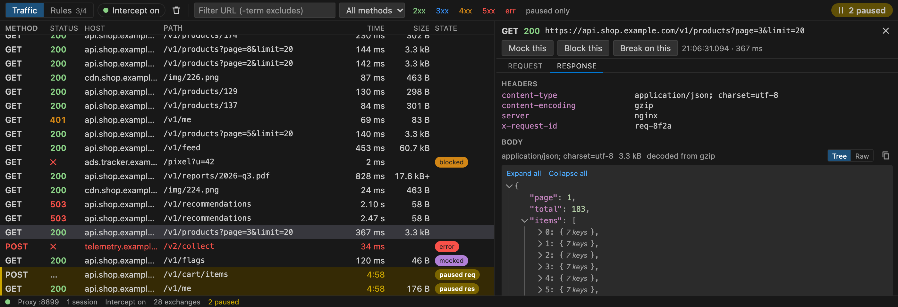
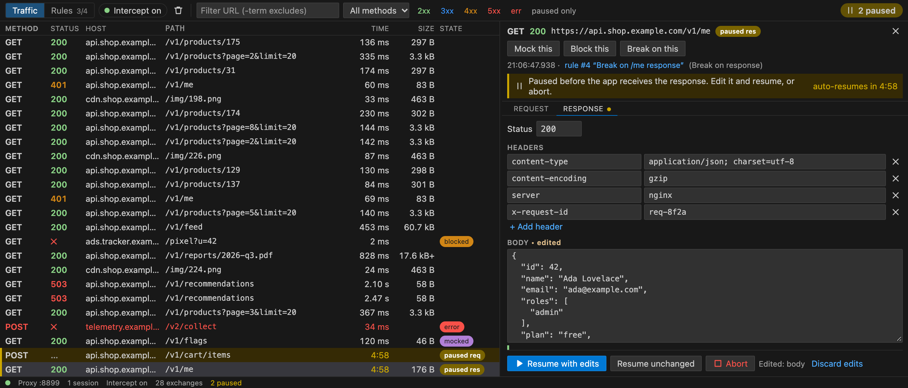
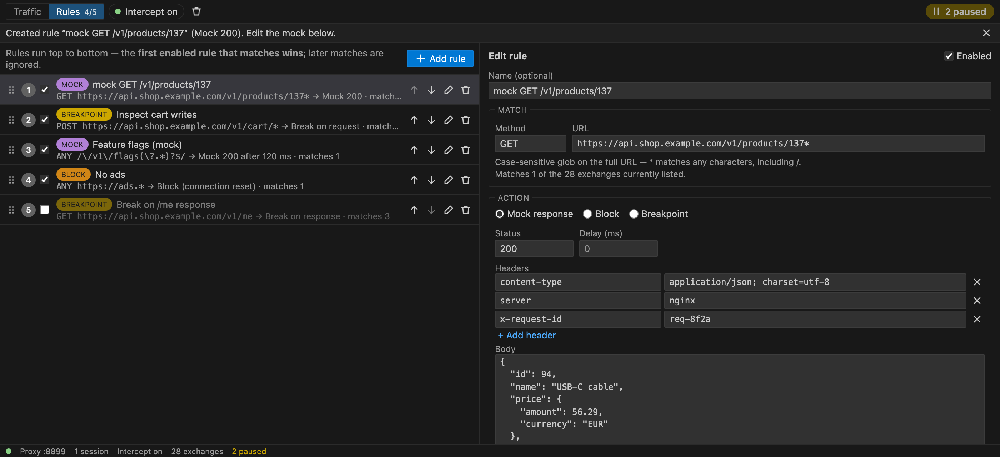

<p align="center">
  
</p>

<h1 align="center">Flutter Intercept</h1>

<p align="center">
  <b>Inspect, pause, edit, block and mock your Flutter app's HTTP traffic, right inside VS Code.</b><br>
  No code in your app. No certificate to install. Just press <b>F5</b>.
</p>

<p align="center">
  <a href="https://marketplace.visualstudio.com/items?itemName=abdulrahman-obaid.flutter-intercept"></a>
  <a href="https://marketplace.visualstudio.com/items?itemName=abdulrahman-obaid.flutter-intercept"></a>
  <a href="LICENSE"></a>
  <a href="https://github.com/abdelrahman-abied/flutter-intercept/actions/workflows/ci.yml"></a>
</p>



## Why Flutter Intercept?

Debugging a Flutter app's network calls usually means a desktop proxy like Charles or Proxyman: configure the
device's proxy, install and trust a certificate, and redo it for every emulator, simulator and phone. Flutter
Intercept skips all of that:

- **Zero setup.** Install the extension and press F5. The traffic panel opens with your requests in it.
- **HTTPS just works.** Nothing to install on the device, simulator or Mac.
- **Your app stays untouched.** No package to add, no code to change. `flutter build` and CI never see it.
- **Works with what you already use:** **Dio**, **package:http** and plain `HttpClient`, so anything built on
  `dart:io`.
- **Every target you debug on:** Android emulators and phones, the iOS simulator, physical iPhones, macOS desktop
  and plain Dart programs.

## Features

| | |
| --- | --- |
| **Live traffic** | Method, status, host, path, timing, size. Filter by URL, method, status class or paused only. |
| **Request and response details** | Headers and bodies, with gzip/deflate/br decoded, a collapsible JSON tree and image previews. |
| **Breakpoints** | Pause a request before it's sent or a response before your app gets it. Edit it, then resume or abort. |
| **Mock** | Answer a request with your own status, headers, body and delay, without calling the server. |
| **Block** | Fail a request with a connection reset or an error status. |
| **One-click rules** | **Mock this**, **Block this** and **Break on this** on any recorded request. |
| **Where did it come from?** | Each request shows the line of your code that made it. **Open source** jumps there. |
| **Copy and resend** | Copy as cURL, Dart http or Dio. Resend a request, or edit it first. |
| **Bad networks** | Offline, Slow 3G, Flaky or custom, for your app only. Throttle and fault rules per endpoint. |
| **Search** | `m:POST s:4xx body:"token" src:login_page.dart` and friends. |
| **Model check** | Each JSON response is checked against your json_serializable / freezed models; fields that would crash `fromJson` are flagged in your model file. |
| **Break a field** | Make a field null, remove it or change it in real responses to reproduce crashes. |
| **Generate code** | Dart models and fixture tests from recorded traffic. |
| **Web, WebSockets, SSE, GraphQL** | Flutter Web on Chrome (with CORS help), WebSocket messages, SSE events, GraphQL operation names. |
| **Native clients** | cupertino_http / cronet_http requests listed read-only; a banner for background isolates. |
| **Rules** | Glob or `/regex/` URL matching plus method. First match wins. Saved per workspace. |
| **Theme-aware** | Follows your VS Code theme: light, dark and high contrast. |

<table>
  <tr>
    <td width="50%"><br><sub>Pause a response and edit its JSON before your app sees it.</sub></td>
    <td width="50%"><br><sub><b>Mock this</b> turns any response into an editable mock.</sub></td>
  </tr>
</table>

## Install

Install **Flutter Intercept** from the
[VS Code Marketplace](https://marketplace.visualstudio.com/items?itemName=abdulrahman-obaid.flutter-intercept),
or from the command line:

```bash
code --install-extension abdulrahman-obaid.flutter-intercept
```

It needs the [Dart extension](https://marketplace.visualstudio.com/items?itemName=Dart-Code.dart-code), which VS
Code installs for you.

## Quick start

1. Open your Flutter project in VS Code.
2. Pick a device and press **F5**, as usual.
3. The **Flutter Intercept → Traffic** panel opens at the bottom, and requests appear as your app makes them.
4. Select a request to see its headers and body, then:
   - **Mock this** to answer with your own response;
   - **Block this** to make it fail;
   - **Break on this** to pause matching requests so you can edit them.
5. Click `Intercept: on` in the status bar to turn interception off for your next sessions.

For a step-by-step walkthrough of every feature, see the
[tutorials](packages/extension/README.md#tutorials).

## Works with AI agents

AI coding agents can drive Flutter Intercept too: GitHub Copilot (agent mode), Claude Code, Cursor, or any MCP
client. They can:
- launch your app and wait for a request, then check exactly what was sent;
- mock a 500, an empty list or a slow response to test error states;
- pause and edit live traffic;
- clean up the rules they added.

Copilot picks up the tools automatically. Other clients connect with **Flutter Intercept: Connect AI Agent**.

You stay in control:
- changes need your confirmation;
- access can be made read-only or turned off;
- secrets are redacted in everything agents read.

See [Use with AI agents](packages/extension/README.md#use-with-ai-agents).

## Supported targets

| Target | Setup |
| --- | --- |
| Android emulator | None. |
| Android phone (adb) | None. Flutter Intercept runs `adb reverse` for you and removes it afterwards. |
| iOS simulator | None. |
| macOS desktop | None, if your app already has the network client entitlement. |
| Plain Dart programs | None. |
| Physical iPhone | One-time setup: signing team, same Wi-Fi as your Mac. See the [iPhone guide](packages/extension/README.md#iphone). |
| Flutter web | Not supported. Web has no `dart:io`. |

Hot reload, hot restart, flavors and profile mode keep working. Release launches are never intercepted.

## How it works

When you start a debug session, Flutter Intercept launches your app through a small generated entry point
instead of `lib/main.dart`. That entry routes `HttpClient` through a proxy running inside VS Code, makes the app
trust that proxy's certificate, and then calls your real `main()`.

```text
F5 ─► generated entry (.dart_tool/flutter_intercept/) ─► your main()
                │
                └─ HttpClient ─► local proxy in VS Code ─► rules ─► Traffic panel
                                        │
                                        └─► the real server
```

- **Nothing in your project changes.** The entry lives in `.dart_tool/`, which Flutter already ignores in git.
- **The app keeps working if the proxy is unreachable.** Requests go direct, with normal TLS verification.

## Privacy and security

- **Your traffic stays on your machine.** The proxy listens on `127.0.0.1` and only forwards requests to the
  servers your app was already calling. Nothing goes to any other service.
- **The only exception is a physical iPhone session.** The proxy then also listens on your Mac's private network
  address. That listener needs a secret token for each session, accepts only your phone, refuses requests aimed
  at your Mac, and closes when the session ends.
- **No certificate is installed anywhere.** Your app trusts one certificate authority, created for your
  installation alone, and only during intercepted debug sessions.
- **The real server's certificate is still checked.** A bad certificate upstream still fails.

Read the full [security notes](packages/extension/README.md#security). To report a vulnerability, see
[SECURITY.md](SECURITY.md).

## Limitations

These aren't intercepted:

- Flutter web on the `web-server` device (Chrome from VS Code works).
- Native HTTP stacks such as `cronet_http` and `cupertino_http` (listed read-only, not interceptable).
- Clients created in background isolates (`compute`, `Isolate.spawn`) — a banner tells you.
- Apps that wrap their code in their own `HttpOverrides` zone.

Certificate pinning with Dio's `validateCertificate` and mTLS client certificates fail while intercepting. See
the full [limitations](packages/extension/README.md#limitations).

## Requirements

- VS Code 1.90 or newer, with the Dart extension.
- Flutter 3.10 or newer (Dart 3.0 to 3.13 tested), or a Dart SDK for console apps.
- Android phones: `adb` from the Android SDK platform-tools.
- Physical iPhones: a Mac with Xcode and a signing team.

## Troubleshooting

- **No traffic appears.** Check that the status bar says `Intercept: on`, and that your app doesn't use one of
  the [native HTTP stacks](#limitations) listed above.
- **F5 isn't intercepted.** Run **Flutter Intercept: Debug with Intercept** from the Command Palette.
- **The port is busy.** Flutter Intercept tries the next free port up to 8999. To choose another, set
  `flutterIntercept.port`.
- **A paused request "gave up".** Your app's own timeout fired while it was paused. Raise the timeout in debug
  builds if you need long pauses.
- **iPhone issues.** Read the [iPhone guide](packages/extension/README.md#iphone).

Still stuck? [Open an issue](https://github.com/abdelrahman-abied/flutter-intercept/issues/new/choose).

## Documentation

- **[User guide](packages/extension/README.md):** features, devices, iPhone setup, settings and commands,
  limitations, security.
- **[Changelog](packages/extension/CHANGELOG.md)**
- **[Development guide](docs/DEVELOPMENT.md):** build, test, repo layout and design docs.

## Contributing

Bug reports, device reports and pull requests are welcome. Start with [CONTRIBUTING.md](CONTRIBUTING.md) and
the [Code of Conduct](CODE_OF_CONDUCT.md).

## License

[MIT](LICENSE) © Abdulrahman Obaid
