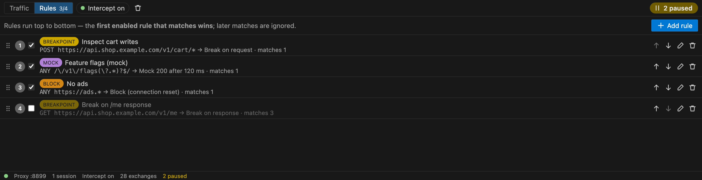
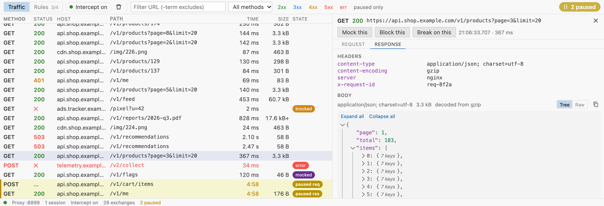

# Flutter Intercept

**View, pause, edit, block and mock your Flutter app's HTTP traffic, right inside VS Code.**
You add no code to your app and there's nothing to set up: install the extension, press **F5** as usual,
and the traffic shows up.

- Works with **Dio**, **package:http** and plain **`HttpClient`**, which covers anything built on `dart:io`.
- HTTPS works too, and you don't install a certificate on the device, simulator or Mac.
- Your app's code is never changed. Nothing is added to `pubspec.yaml`, and `flutter build` / CI never see the
  tool.

## How it works

1. When you start a Flutter (or Dart) debug session, Flutter Intercept writes a small launcher to
   `.dart_tool/flutter_intercept/entry_<name>.dart` and runs that instead of `lib/main.dart` (or your flavor
   target). Flutter's default `.gitignore` already ignores `.dart_tool/`.
2. The launcher installs `HttpOverrides`, which send every `HttpClient` to a proxy on your machine
   (`PROXY <host>:<port>; DIRECT`), and makes the app trust that proxy's certificate authority. It then
   calls your real `main()`.
3. A man-in-the-middle proxy inside the extension records each exchange and applies your rules. The panel at the
   bottom of VS Code shows the traffic.
4. If the proxy isn't reachable, requests go `DIRECT` and the app keeps working. Builds made outside VS Code
   (`flutter build`, `flutter run` in a terminal, CI) are untouched.

## Features

**Live traffic list**
- Every request shows its method, status, host, path, time, size and state (paused, mocked, blocked, error).
- Filter by URL text, method, status class (2xx–5xx, errors) or paused only. The text box also takes filters:
  `m:POST`, `s:4xx`, `s:error`, `t:json`, `body:"token"`, `h:authorization`, `state:mocked`, `src:login_page.dart`
  (prefix any of them with `-` to exclude).
- Keyboard navigation and a resizable detail pane.

**Where a request came from**
- The detail pane shows the line of your code that made the request (for example
  `CatalogApi.fetchAlbum  lib/api/catalog_api.dart:37`). **Open source** jumps there; expand it for the whole
  stack. Works with `package:http`, `HttpClient` and Dio (including interceptors).
- In profile builds Dio requests get no call site, and columns are missing (AOT stacks are shorter).
- Turn it off with `flutterIntercept.captureSource`.

**Model check: your models vs the real API**
- Every JSON response is checked against your json_serializable / freezed models — the generated
  `_$UserFromJson` in `*.g.dart`, which is exactly what runs on it.
- A field that would make `fromJson` throw (a `null` in a non-nullable field, a string where an `int` belongs,
  an unknown enum value) is shown on the request and as an error on that field in your model file.
- Requests are matched to models through Retrofit / Chopper declarations or the call stack; pick one yourself
  with **Check against a model…**. Turn it off with `flutterIntercept.contractCheck`.

**Break a field on purpose**
- Right-click a field in a response: **Make null in next responses**, **Remove from next responses** or
  **Change value…**. Or add a **Mutate JSON** rule. The real response reaches your app with that change.

**Generate code**
- **Generate Dart model** (freezed, json_serializable or plain, matching your project) from every recorded
  sample of a route, and **Generate test fixture** (JSON fixtures + a http_mock_adapter / MockClient / mocktail
  test). Both open as unsaved editors.

**WebSockets, SSE and GraphQL**
- WebSocket connections and Server-Sent Events streams are recorded message by message, live, in a **Messages**
  tab. Block and fault rules work on sockets.
- GraphQL requests show their operation name; filter with `op:getUser` and match rules to one operation.

**Copy and resend**
- **Copy as cURL**, **Copy as Dart (http)** or **Copy as Dio** from the detail pane or a row's right-click menu.
- **Resend** a request unchanged, or **Edit and resend** it. The new request is listed with a link to the original.

**Request and response details**
- Headers and bodies. gzip/deflate/br are decoded, JSON shows as a collapsible tree, binary bodies show their
  size, and images get a preview.

**Breakpoints**
- Pause a request before it reaches the server, or a response before your app receives it.
- Edit the method, URL, headers and body (request) or the status, headers and body (response), then
  **Resume with edits**, **Resume unchanged** or **Abort**.
- JSON bodies are validated as you type.
- A countdown shows when an untouched breakpoint auto-resumes (after 5 minutes).

**Mock and block**
- Answer requests with a mock (status, headers, body, optional delay) or block them (connection reset or an
  error status). Neither contacts the server.
- **Mock this**, **Block this** and **Break on this** turn any recorded exchange into a rule in one click. The
  new rule goes to the top, and a mock opens in the editor so you can change its body.

**Bad networks**
- The toolbar's network picker slows down or cuts off the app you're debugging (not your Mac): **Offline**,
  **Slow 3G**, **Fast 3G**, **Flaky (20% fail)** or **Custom** latency, bandwidth and failure rate. The status line
  shows it while it's on.
- **Throttle** and **Fault** rules do the same for one endpoint. Faults: connection reset, timeout (the request
  is held until your app gives up), response cut off half-way, and failed lookup (the connection closes without a
  response).

**Rules**
- Each rule matches on method plus URL. The URL is a glob such as `https://api.example.com/users/*` or a
  `/regex/`. Regexes that could take very long on a long URL (nested repeats like `(.+)+`, backreferences) are
  refused and the rule shows as invalid; AI agents can only use globs.
- Rules run top to bottom and the first enabled match wins. The list shows which rules are shadowed by an
  earlier one.
- Reorder, enable/disable, delete with undo. Rules are saved per workspace.
- A rule can apply to **only the first N requests** or **expire** after a time; it removes itself afterwards.

**Status bar**
- `Intercept: on/off` toggles interception for new sessions. It shows `· LAN` while an iPhone session runs.
- A pause counter appears while exchanges are waiting at a breakpoint.

The panel follows your VS Code theme: light, dark and high contrast.

## Devices

| Target | What happens |
|---|---|
| **Android emulator** | The app reaches the proxy at `10.0.2.2`. No setup. |
| **Android physical device** (via adb) | Flutter Intercept runs `adb reverse` for the proxy port and removes it when the last session ends. adb is found through `ANDROID_HOME`/`ANDROID_SDK_ROOT`, the default SDK location, or `PATH`. |
| **iOS simulator** | Uses `localhost`. No setup. |
| **macOS desktop** | Uses `localhost`. The app needs the `com.apple.security.network.client` entitlement, which any macOS app that already does networking has. |
| **Plain Dart programs** (`bin/main.dart`) | Intercepted the same way. |
| **iPhone** (physical) | Supported, after some one-time setup; see [iPhone](#iphone) below. Verified over Wi-Fi. On Apple Silicon Macs, a USB connection also needs Rosetta. |
| **Flutter web** | Not supported (no `dart:io`). The session is left untouched. |

Hot reload, hot restart, flavors (`lib/main_dev.dart` etc.) and `--profile` keep working through the generated
entry. **Release launches** (`flutterMode: "release"` or `--release`) are never intercepted. They run your
normal entry point.

## iPhone

A physical iPhone can't reach your Mac's `localhost`. So while an iPhone debug session runs, and only then:
- The proxy also listens on your Mac's Wi-Fi/LAN IPv4 address.
- The status bar shows `Intercept: on · LAN`, and the Traffic panel shows `LAN open for iPhone · <ip>:<port>`.

The LAN listener is protected:
- **Secret token.** Each opening gets a fresh random token, which only the app launched in that session
  receives (as a build define). Requests without it get `407` and the connection is closed. The token never appears in the
  UI or the extension's log.
- **No access to your Mac.** Requests from the phone aimed at the Mac itself (its own addresses,
  `localhost`, link-local) are refused with `403`.
- **Locked to your iPhone.** The listener only accepts the first device that connects with the token, and the
  status tooltip shows `locked to <ip>`.
- **Private networks only.** It only listens on a private (RFC 1918) address: `10.x`, `172.16–31.x` or `192.168.x`.
- **Closes automatically.** The listener closes when the last iPhone session ends, or as soon as your Mac's
  network changes (new address, or a different Wi-Fi/router). After a network change, relaunch the iPhone session.
  Everything else stays on `127.0.0.1`.

Verified on an iPhone 16 Pro Max (iOS 27) over Wi-Fi, in debug and profile mode.

**One-time setup**

1. **Xcode → Settings → Accounts**: add the Apple Account of your signing team, and select that team for the
   app (automatic signing works).
2. **On the iPhone**, the first time you install an app signed by your account: Settings → General → VPN &
   Device Management → your developer certificate → **Trust**.
3. **On the iPhone**, when the app first starts: allow it to **find and connect to devices on your local
   network**.
4. **On the Mac**, the first time the LAN listener opens: allow **Visual Studio Code** to accept incoming
   network connections. Also allow Local Network access for VS Code if macOS asks.

Flutter Intercept reminds you of steps 3 and 4 once.

**Good to know**

- **Network.** The iPhone must be on the **same Wi-Fi** as the Mac, and unlocked while the app installs and
  launches. If your Mac has no private Wi-Fi/Ethernet IPv4 address (none at all, a public address, or carrier-grade
  NAT `100.64.x`), the session runs without interception and you get a warning.
- **Use a trusted Wi-Fi.** The token travels unencrypted inside the proxy request. On shared or public Wi-Fi,
  others on the network may be able to observe it.
- **Apple Silicon Macs and USB.** Flutter's bundled `iproxy`, which a USB iPhone needs, is x86_64-only. So a USB
  iPhone needs **Rosetta**: `sudo softwareupdate --install-rosetta --agree-to-license`.
  - The alternative is to pair the iPhone over Wi-Fi (Xcode → Window → Devices and Simulators → **Connect via
    network**). Wireless runs don't use `iproxy`.
  - Flutter Intercept warns you before launching on a USB iPhone when Rosetta is missing.
- **Stale token.** If a build launched with an old token keeps running after the listener was reopened,
  its HTTPS goes direct (not intercepted) and plain `http://` requests get `407`. Relaunch the session to fix
  it. The extension keeps the token stable while any iPhone session is alive.
- **Free signing teams.** A personal (free) team's provisioning profile expires after **7 days**. Rebuild to
  renew it.
- **Wireless launches are slower.** The first debug launch over Wi-Fi can take around 40 s to install and start.

## Use with AI agents

AI coding agents can use Flutter Intercept the way you do. They can run the app, watch its requests, check what was
sent, and fake server responses to test error states. This works with GitHub Copilot (agent mode), Claude Code,
Cursor, and any client that speaks MCP (Model Context Protocol).

| What the agent can do | Tool |
| --- | --- |
| See whether the proxy and app sessions are running | `get_status` |
| List recent requests (filter by URL, method, status, state) | `list_requests` |
| Read one request in full (headers, bodies, timings, error) | `get_request` |
| Wait until the app makes a matching request (with a timeout) | `wait_for_request` |
| See requests paused at a breakpoint | `list_paused` |
| List the rules in priority order | `list_rules` |
| Answer matching requests with a mock (status, headers, body, delay) | `add_mock` |
| Block matching requests | `add_block` |
| Pause matching requests or responses | `add_breakpoint` |
| Remove a rule | `remove_rule` |
| Resume a paused request, optionally with edits, or abort it | `resume_request`, `abort_request` |
| Clear the recorded traffic | `clear_requests` |
| Save the traffic as a HAR file in `.dart_tool/flutter_intercept/exports/` | `export_har` |
| Launch the app through Dart-Code, stop it, or hot-restart it | `launch_app`, `stop_app`, `hot_restart` |
| Find the file and line that sent a request | `get_request_source` |
| See the structure of a large JSON body without reading it | `get_body_shape` |
| Slow down or cut off the network (everything, or one URL) | `simulate_network` |
| Send a recorded request again, optionally edited (same server only) | `resend_request` |
| Check responses against your Dart models | `check_contract` |
| Generate a Dart model or a fixture test from recorded traffic | `generate_model`, `generate_fixture_test` |
| Check traffic with pass/fail expectations (status, count, order, JSON paths, duration) | `assert_traffic` |
| Change fields in real JSON responses (null, remove, set) | `add_mutation` |
| Read WebSocket messages and SSE events | `get_frames` |
| Add CORS headers to a real API while developing (Flutter Web) | `add_cors_rule` |

Over MCP there are also resources (`intercept://exchange/{id}`, `intercept://paused`, `intercept://rules`,
`intercept://contract/{id}`) and prompts (`debug-failing-request`, `test-error-states`, `verify-change`,
`build-api-layer-from-traffic`).

`get_request` can also return the request as a cURL, Dart http or Dio snippet. `add_mock`, `add_block` and
`add_breakpoint` take `times` and `ttlMs`, so rules an agent adds can clean themselves up.

In VS Code the tools are named `flutter_intercept_<tool>`; over MCP they use the names above.

### Connecting

- **GitHub Copilot (agent mode in VS Code):** nothing to set up. The tools are available as soon as the extension
  is installed.
- **Claude Code, Cursor and other MCP clients:**
  1. Run **Flutter Intercept: Connect AI agent** and pick your client.
  2. The command copies the setup to the clipboard: the `claude mcp add …` command for Claude Code, an
     `mcp.json` snippet for Cursor, or the URL and header for other clients.
  3. Paste it into your client. The command never writes config files itself.
- **The MCP server** runs at `http://127.0.0.1:<port>/mcp` (default port 47823) and accepts only local
  connections that carry its secret token.

### Access, confirmations and secrets

- **Access level.** `flutterIntercept.agent.access` decides what agents may do:
  - `readWrite` (the default);
  - `readOnly`: agents can look, but changes are refused;
  - `off`: nothing is exposed.
- **Confirmations.** Every tool that changes something asks you to confirm in the client: adding or removing
  rules, resuming or aborting requests, clearing traffic, and launching, stopping or restarting the app.
- **Secret redaction.** With `flutterIntercept.agent.redactSecrets` on (the default), agents see `[redacted]`
  instead of:
  - authorization, cookie and token-like headers;
  - password, token, key and session fields in URLs and JSON bodies.

  Redaction only affects what agents read. Your app always receives the real values.
- **What agents never see:** Flutter Intercept's CA key, the iPhone LAN token, or the MCP token.
- **Agent rules are marked.** Rules an agent creates are named `[agent] …`. They get an **agent** badge in the
  rules list and on the requests they match.
- **The status line** shows whether an agent is connected and its last tool call, for example
  `Agent: connected · last: wait_for_request 3s ago`.

### Teach your agent the workflow

Run **Flutter Intercept: Add AI Agent Instructions** and pick `AGENTS.md`, `CLAUDE.md` and/or
`.github/copilot-instructions.md`. It adds a short section that tells agents:
- to verify changes against real traffic: launch the app, then `wait_for_request`, then `get_request`;
- to test error states with mocks;
- to clean up the rules they add.

The section sits between `<!-- flutter-intercept:start -->` and `<!-- flutter-intercept:end -->` markers.
Running the command again updates it in place, and the rest of the file is left alone.

### Example prompts

- "Run the app and check that the login request sends the email and password."
- "Make the products endpoint return 500 and check that the error UI shows up, then remove the mock."
- "Mock the feed endpoint with a 10-second delay and check the loading state."
- "Pause the next checkout request, change the quantity to 3, and resume it."

## Flutter Web

Run your web app on **Chrome** from VS Code as usual. The Chrome that `flutter run` starts uses Flutter
Intercept as its proxy and trusts only its CA (pinned by key); your everyday browser is not touched.

- Browser requests show CORS problems ("No Access-Control-Allow-Origin header…"). Mocks answer their own
  preflights. **Add CORS rule (dev only)** adds the CORS headers to a real API's responses while you develop —
  your server still needs the right CORS setup for production.
- Chrome's own background requests are hidden; **Show browser traffic** shows them.
- Everything you open in that debug Chrome window goes through the proxy and is recorded (like any site you
  browse there), so keep it to your app. Launches that use your own Chrome profile (`--user-data-dir`) are not
  intercepted.
- Not intercepted: the `web-server` device (you open the page in your own browser) and release builds.

## Settings and commands

| Setting | Default | Description |
|---|---|---|
| `flutterIntercept.enabled` | `true` | Route the HTTP traffic of Dart/Flutter debug sessions through Flutter Intercept. When off, sessions launch untouched. |
| `flutterIntercept.port` | `8899` | Port of the local proxy. If it's busy, the next free port up to 8999 is used. A change applies at the next launch when no intercepted session is running. |
| `flutterIntercept.agent.access` | `readWrite` | What AI agents may do: `readWrite`, `readOnly` or `off`. See [Use with AI agents](#use-with-ai-agents). |
| `flutterIntercept.agent.redactSecrets` | `true` | Show secrets (auth headers, cookies, tokens, passwords) to agents as `[redacted]`. |
| `flutterIntercept.captureSource` | `true` | Record which line of your code made each request (see [Where a request came from](#features)). Applies at the next launch. Flutter sessions only: plain Dart programs can't take the setting (the Dart VM rejects `--dart-define`) and always record. |
| `flutterIntercept.web.enabled` | `true` | Intercept Flutter Web apps launched in Chrome from VS Code. |
| `flutterIntercept.nativeClients` | `profile` | List requests of native HTTP clients (cupertino_http, cronet_http) read-only from the app's HTTP profile, or `off`. |
| `flutterIntercept.contractCheck` | `true` | Check JSON responses against your json_serializable / freezed models and show fields that would make `fromJson` throw. |
| `flutterIntercept.rewriteLocalhost` | `true` | Requests to `10.0.2.2` / `10.0.3.2` (the emulator's names for your Mac) go to your Mac's `localhost`. Never applies to iPhones. |
| `flutterIntercept.agent.mcpPort` | `47823` | Port of the local MCP server for agents. If it's busy, the next free port is used. |

| Command | What it does |
|---|---|
| **Flutter Intercept: Open Traffic Panel** | Shows the Traffic panel. It also opens by itself on the first intercepted session. |
| **Flutter Intercept: Toggle Interception** | Same as clicking `Intercept: on/off` in the status bar. |
| **Flutter Intercept: Clear Traffic** | Clears the list. Requests still in flight stay. |
| **Flutter Intercept: Debug with Intercept** | Starts an intercepted debug session directly. A fallback if F5 isn't picked up. |
| **Flutter Intercept: Connect AI agent** | Copies the setup for Claude Code, Cursor or another MCP client to the clipboard. |
| **Flutter Intercept: Add AI Agent Instructions** | Adds or updates the Flutter Intercept section in `AGENTS.md`, `CLAUDE.md` or `.github/copilot-instructions.md`. |

## Limitations

What isn't intercepted, or behaves differently while intercepting:

- **Flutter web**: only on Chrome launched from VS Code (not the `web-server` device). There is no direct
  fallback: if the proxy stops, the page loses network until you restart the session.
- **Native HTTP stacks**: `cronet_http`, `cupertino_http`, `native_dio_adapter` bypass `dart:io`. Their requests
  are listed read-only (from the app's HTTP profile) but can't be mocked, paused or blocked.
- **Background isolates** (`compute`, `Isolate.run`, `Isolate.spawn`): `HttpOverrides` apply per isolate, so
  clients created there go direct. A banner tells you when the app starts one.
- **Apps that install their own `HttpOverrides` zone** (`HttpOverrides.runWithHttpOverrides` or `runZoned`
  around their code): the inner zone wins.
  - Setting `HttpOverrides.global` is fine: your overrides still apply underneath.
  - Setting `findProxy` on a client is also fine: Flutter Intercept ignores the assignment and prints a note.
- **Dio `validateCertificate` pinning**: Dio checks the certificate it receives, which is the proxy's, so those
  requests fail with `bad certificate` while intercepting. Turn interception off to test pinning.
- **mTLS (client certificates)**: the proxy can't present your app's client certificate to the server.
- **A custom `connectionFactory`** that ignores the proxy host and port bypasses the proxy.
- **Throttling and faults** don't slow down uploads and don't apply to WebSockets.
- **Long breakpoints and client timeouts**: if your app's own timeout fires while a request is paused (for
  example Dio's `receiveTimeout`), the app gives up. The exchange is then marked "gave up" and can't be resumed.
  Raise the timeout in debug builds if you need long pauses.
- **What the panel keeps**: bodies are shown up to 5 MB, after which they're marked truncated. Recorded traffic
  is cleared when the window reloads; rules are kept.

## Security

- **Loopback only, except during iPhone sessions.** The proxy listens on `127.0.0.1`. Only while a physical
  iPhone session runs does it also listen on your Mac's private LAN address. That listener requires the session's
  secret token, locks to the first device that connects with it, and refuses requests aimed at the Mac itself.
  It closes when the session ends or the network changes (see [iPhone](#iphone)).
  - **Use it on a trusted Wi-Fi.** On shared or public Wi-Fi, others may observe the token.
  - **The token reaches disk.** It is a build define, so `flutter_tools` writes it into
    `ios/Flutter/Generated.xcconfig` and `ios/Flutter/flutter_export_environment.sh` (both gitignored by default)
    and into the debug app. It is only usable while that session's listener is open, and only from the device it
    locked to.
- **AI agent access is local and gated.** The MCP server for agents listens on `127.0.0.1` only.
  - Every request must carry a secret token, which is kept in VS Code's secret storage. Requests from browsers
    (an `Origin` header or a foreign `Host`) are refused.
  - Changes need your confirmation, and `flutterIntercept.agent.access` can make access read-only or turn it off.
  - Secrets are redacted in everything agents read. See [Use with AI agents](#use-with-ai-agents).
- **Only sessions you launch from VS Code** while interception is on.
  - It doesn't attach to running apps.
  - It leaves test runs and web sessions alone.
  - It never intercepts release launches.
- **The app trusts one certificate authority.** It doesn't accept arbitrary certificates.
  - On first use the extension creates a CA unique to your installation. It's stored in VS Code's extension
    storage on your Mac, readable only by your user.
  - The generated launcher makes the app trust that CA in intercepted sessions. Nothing is installed in any
    system trust store.
  - If the proxy isn't reachable, the `DIRECT` fallback keeps normal TLS verification.
- **Your own pinning:**
  - While the proxy is up, pinning via `badCertificateCallback` or `SecurityContext(withTrustedRoots: false)`
    doesn't block interception.
  - With the proxy down, your pinning behaves exactly as without the tool.
  - Dio `validateCertificate` pinning still fails while intercepting (see Limitations).
- **The real server's certificate is still verified.** By default the proxy checks it, so a bad certificate
  upstream still fails, and the app gets a `502` that carries the error.

## Requirements

- VS Code 1.90 or newer.
- The [Dart extension](https://marketplace.visualstudio.com/items?itemName=Dart-Code.dart-code)
  (`Dart-Code.dart-code`). It's installed automatically as a dependency, and it's what F5 runs.
- A Flutter SDK (or Dart SDK for console apps). The generated launcher is tested with Dart 3.0 to 3.13
  (Flutter 3.10 and newer).
- For Android physical devices: `adb` (part of the Android SDK platform-tools).
- For iPhones: Xcode with a signing team (see [iPhone](#iphone)).
